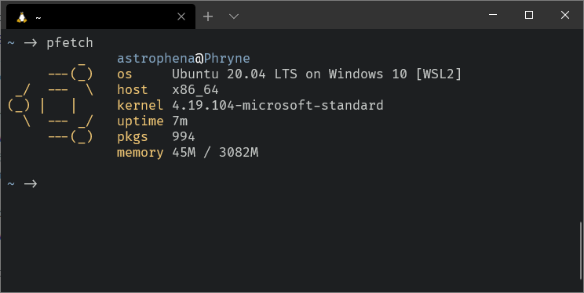

<div align="center">
  <br>
  
  <h1><a href="https://github.com/astrophena">@astrophena</a> does dotfiles</h1>
</div>

A set of configuration files that defines my computing environment.

Managed with [rcm](https://github.com/thoughtbot/rcm).

## Installation

1. [Install rcm](https://github.com/thoughtbot/rcm#installation)
   if you haven't yet.

2. Check out this repository from [GitHub](https://github.com) to `~/src/dotfiles`:

```sh
git clone https://github.com/astrophena/dotfiles ~/src/dotfiles
```

3. Install:

```sh
RCRC="$HOME/src/dotfiles/rcrc" rcup
```

## Updating

Just run `u`. It will pull the latest changes, symlink new files and reload `~/.bashrc`.

## License

[MIT](LICENSE.md) © [Ilya Mateyko](https://github.com/astrophena), except files:

* `termux/font.ttf` ([license](https://github.com/tonsky/FiraCode/blob/master/LICENSE))
* `bin/e` ([license](https://github.com/holman/dotfiles/blob/master/LICENSE.md))
* `bin/git-credential-netrc` ([license](https://github.com/git/git/blob/master/contrib/credential/netrc/git-credential-netrc.perl#L69))
